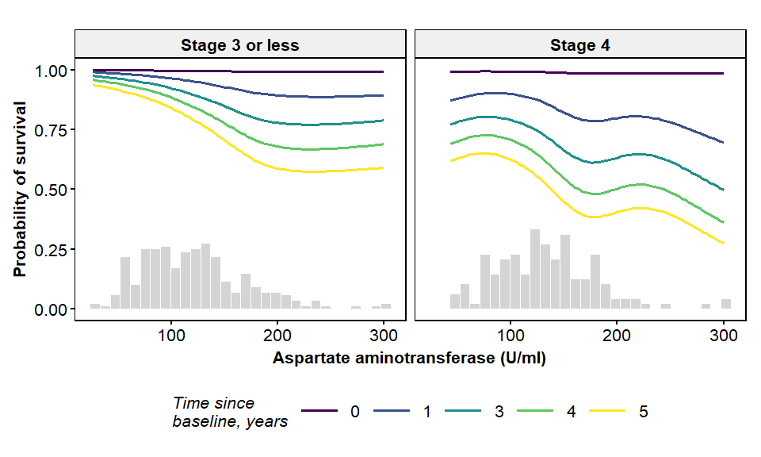

<!-- README.md is generated from README.Rmd. Please edit that file -->
Overview
========

Oblique random survival forest (ORSFs) are ensembles for right-censured survival data that use linear combinations of input variables to recursively partition a set of training data. Regularized Cox proportional hazard models identify optimal linear combinations of input variables in each recursive partitioning step while building survival trees.

Installation
============

You can install obliqueRSF from github with:

``` r
# install.packages("devtools")
devtools::install_github("bcjaeger/obliqueRSF")
```

Usage
=====

The `ORSF` function is the center piece of the `obliqueRSF` package

``` r

# remove missings
data("pbc",package='survival')

# event is death
# censored at time of last contact or transplant
pbc$status[pbc$status>=1]=pbc$status[pbc$status>=1]-1

# format categorical variables as factors
pbc = pbc %>% 
  dplyr::select(-id)%>%
  mutate(trt=factor(trt),
         ascites=factor(ascites),
         hepato=factor(hepato),
         spiders=factor(spiders),
         edema=factor(edema),
         stage=factor(stage,ordered=TRUE))

set.seed(62689)
orsf=ORSF(data=pbc,ntree=1000,minsplit=30,tree.err=T,verbose=F)
#> 
#> performing imputation with missForest:
#>   missForest iteration 1 in progress...done!
#>   missForest iteration 2 in progress...done!
#>   missForest iteration 3 in progress...done!
#>   missForest iteration 4 in progress...done!
#>   missForest iteration 5 in progress...done!
#>   missForest iteration 6 in progress...done!
#>   missForest iteration 7 in progress...done!

print(orsf)
#> 
#> Oblique Random Survival Forest: ORSF(data = pbc, minsplit = 30, ntree = 1000, verbose = F, tree.err = T)
#> 
#> Out of bag error estimates: (lower is better )
#>   integrated Brier score: 0.11636 
#>   integrated concordance: 0.15610

labs=c("Concordance Index","Brier Score")

orsf$tree_err%>%
  tidyr::gather(variable,value,-trees)%>%
  mutate(variable=factor(variable,labels=labs))%>%
  ggplot(aes(x=trees,y=value))+
  geom_line(size=1)+
  facet_wrap(~variable,scales='free')+
  theme_bw()+theme(
    panel.grid = element_blank(),
    axis.text = element_text(face='bold',size=12, color='black'),
    axis.title = element_text(face='bold',size=12, color='black'),
    strip.text = element_text(face='bold',size=12,color='black'))+
    labs(x='Number of trees', y='Error')
```



Performance
===========

`orsf` objects take a long time to grow, but they usually provide excellent predictions. Below we use the `pec` package to compare the integrated Brier scores over 50 replications of bootstrap cross validation using the complete cases in the `pbc` data set.

``` r

pbc=na.omit(pbc)

ntree=500
nsize=30

cif_cntrl=cforest_unbiased(ntree=ntree,minsplit=nsize)

mdls=list(
  orsf=ORSF(data=pbc, verbose=FALSE, alpha=0.1,
            ntree=ntree,minsplit=nsize),
  rsf =rfsrc(Surv(time,status)~.,data=pbc,
             ntree=ntree,nodesize=nsize),
  cif =pec::pecCforest(Surv(time,status)~.,data=pbc, controls=cif_cntrl),
  cboost = pec::coxboost(Hist(time,status)~.,
                       data=pbc,penalty=1000)
)

# for reproducibility
set.seed(329) 

bri_score = pec::pec(mdls, data=pbc, cens.model = 'cox',
                     formula = Surv(time,status)~age, 
                     splitMethod = 'BootCv', B=10)
#> Split sample loop (B=10)
#> Warning: executing %dopar% sequentially: no parallel backend registered
#> 1
#> 2
#> 3
#> 4
#> 5
#> 6
#> 7
#> 8
#> 9
#> 10

print(bri_score)
#> 
#> Prediction error curves
#> 
#> Prediction models:
#> 
#> Reference      orsf       rsf       cif    cboost 
#> Reference      orsf       rsf       cif    cboost 
#> 
#> Right-censored response of a survival model
#> 
#> No.Observations: 276 
#> 
#> Pattern:
#>                 Freq
#>  event          111 
#>  right.censored 165 
#> 
#> IPCW: cox model
#> 
#> Method for estimating the prediction error:
#> 
#> Bootstrap cross-validation
#> 
#> Type: resampling
#> Bootstrap sample size:  276 
#> No. bootstrap samples:  10 
#> Sample size:  276 
#> 
#> Cumulative prediction error, aka Integrated Brier score  (IBS)
#>  aka Cumulative rank probability score
#> 
#> Range of integration: 0 and time=4500 :
#> 
#> 
#> Integrated Brier score (crps):
#> 
#>           IBS[0;time=4500)
#> Reference            0.183
#> orsf                 0.113
#> rsf                  0.119
#> cif                  0.118
#> cboost               0.121


cnc_index = pec::cindex(mdls, data=pbc, cens.model = 'cox',
                        formula = Surv(time,status)~age, 
                        splitMethod = 'BootCv', B=10)
#> 1
#> 2
#> 3
#> 4
#> 5
#> 6
#> 7
#> 8
#> 9
#> 10

print(cnc_index)
#> 
#> The c-index for right censored event times
#> 
#> Prediction models:
#> 
#>   orsf    rsf    cif cboost 
#>   orsf    rsf    cif cboost 
#> 
#> Right-censored response of a survival model
#> 
#> No.Observations: 276 
#> 
#> Pattern:
#>                 Freq
#>  event          111 
#>  right.censored 165 
#> 
#> Censoring model for IPCW: cox model  
#> 
#> Method for estimating the prediction error:
#> 
#> Bootstrap cross-validation
#> 
#> Type: resampling
#> Bootstrap sample size:  276 
#> No. bootstrap samples:  10 
#> Sample size:  276 
#> 
#> Estimated C-index in % at time=4191 
#> 
#>        AppCindex BootCvCindex
#> orsf        85.3         80.3
#> rsf         86.8         79.9
#> cif         84.9         77.9
#> cboost      79.3         78.3
#> 
#> AppCindex    : Apparent (training data) performance
#> BootCvCindex : Bootstrap crossvalidated performance
```
