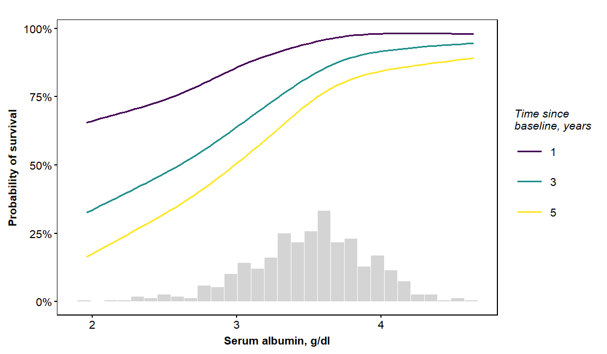

<!-- README.md is generated from README.Rmd. Please edit that file -->
Overview
========

Oblique random survival forest (ORSFs) are ensembles for right-censured survival data that use linear combinations of input variables to recursively partition a set of training data. Regularized Cox proportional hazard models identify optimal linear combinations of input variables in each recursive partitioning step while building survival trees.

Installation
============

You can install obliqueRSF from github with:

``` r
# install.packages("devtools")
devtools::install_github("bcjaeger/obliqueRSF")
```

Usage
=====

The `ORSF` function is the center piece of the `obliqueRSF` package

``` r

data("pbc",package='survival')

# event is death
# censor study participants at time of last contact or transplant
pbc$status[pbc$status>=1]=pbc$status[pbc$status>=1]-1

# format categorical variables as factors
# if we don't do this, missforest will not impute 0/1 variables 
# in the way that we would like it to.
pbc = pbc %>% 
  dplyr::select(-id)%>%
  mutate(
    trt=factor(trt),
    ascites=factor(ascites),
    hepato=factor(hepato),
    spiders=factor(spiders),
    edema=factor(edema),
    stage=factor(stage,ordered=TRUE),
    time=time/365.25
  ) 

orsf=ORSF(
  data=pbc, # data to fit trees with
  ntree=100, # number of trees to fit
  eval_times=c(1:10), # when will predictions be made?
  # note: eval_times will be used to make figures
  verbose=T,# suppresses console output
  compute_oob_predictions = TRUE # return OOB preds
) 
#> 
#> performing imputation with missForest:
#>   missForest iteration 1 in progress...done!
#>   missForest iteration 2 in progress...done!
#>   missForest iteration 3 in progress...done!
#>   missForest iteration 4 in progress...done!
#>   missForest iteration 5 in progress...done!
#>   missForest iteration 6 in progress...done!
#>   missForest iteration 7 in progress...done!
#>   missForest iteration 8 in progress...done!
#>   missForest iteration 9 in progress...done!
#>   missForest iteration 10 in progress...done!
#> Fitting tree no. 1
#> Fitting tree no. 2
#> Fitting tree no. 3
#> Fitting tree no. 4
#> Fitting tree no. 5
#> Fitting tree no. 6
#> Fitting tree no. 7
#> Fitting tree no. 8
#> Fitting tree no. 9
#> Fitting tree no. 10
#> Fitting tree no. 11
#> Fitting tree no. 12
#> Fitting tree no. 13
#> Fitting tree no. 14
#> Fitting tree no. 15
#> Fitting tree no. 16
#> Fitting tree no. 17
#> Fitting tree no. 18
#> Fitting tree no. 19
#> Fitting tree no. 20
#> Fitting tree no. 21
#> Fitting tree no. 22
#> Fitting tree no. 23
#> Fitting tree no. 24
#> Fitting tree no. 25
#> Fitting tree no. 26
#> Fitting tree no. 27
#> Fitting tree no. 28
#> Fitting tree no. 29
#> Fitting tree no. 30
#> Fitting tree no. 31
#> Fitting tree no. 32
#> Fitting tree no. 33
#> Fitting tree no. 34
#> Fitting tree no. 35
#> Fitting tree no. 36
#> Fitting tree no. 37
#> Fitting tree no. 38
#> Fitting tree no. 39
#> Fitting tree no. 40
#> Fitting tree no. 41
#> Fitting tree no. 42
#> Fitting tree no. 43
#> Fitting tree no. 44
#> Fitting tree no. 45
#> Fitting tree no. 46
#> Fitting tree no. 47
#> Fitting tree no. 48
#> Fitting tree no. 49
#> Fitting tree no. 50
#> Fitting tree no. 51
#> Fitting tree no. 52
#> Fitting tree no. 53
#> Fitting tree no. 54
#> Fitting tree no. 55
#> Fitting tree no. 56
#> Fitting tree no. 57
#> Fitting tree no. 58
#> Fitting tree no. 59
#> Fitting tree no. 60
#> Fitting tree no. 61
#> Fitting tree no. 62
#> Fitting tree no. 63
#> Fitting tree no. 64
#> Fitting tree no. 65
#> Fitting tree no. 66
#> Fitting tree no. 67
#> Fitting tree no. 68
#> Fitting tree no. 69
#> Fitting tree no. 70
#> Fitting tree no. 71
#> Fitting tree no. 72
#> Fitting tree no. 73
#> Fitting tree no. 74
#> Fitting tree no. 75
#> Fitting tree no. 76
#> Fitting tree no. 77
#> Fitting tree no. 78
#> Fitting tree no. 79
#> Fitting tree no. 80
#> Fitting tree no. 81
#> Fitting tree no. 82
#> Fitting tree no. 83
#> Fitting tree no. 84
#> Fitting tree no. 85
#> Fitting tree no. 86
#> Fitting tree no. 87
#> Fitting tree no. 88
#> Fitting tree no. 89
#> Fitting tree no. 90
#> Fitting tree no. 91
#> Fitting tree no. 92
#> Fitting tree no. 93
#> Fitting tree no. 94
#> Fitting tree no. 95
#> Fitting tree no. 96
#> Fitting tree no. 97
#> Fitting tree no. 98
#> Fitting tree no. 99
#> Fitting tree no. 100
```

The `vdplot` function allows you to quickly look at the patterns in the predictions from an ORSF.

``` r
# Variable dependence plot (vdplot)

# Survival probabilities for a continuous variable
# note the use of sub_times, which allows you to pick
# one or more times in the evaluation times of an ORSF object

vdplot(object=orsf, xvar='bili', xlab='Bilirubin levels', 
       xvar_units = 'mg/dl', sub_times = 5)
#> `stat_bin()` using `bins = 30`. Pick better value with `binwidth`.
```


here is another application of `vdplot` with a continuous x-variable, but this time we will show predictions at three times: 1 year, 3 years, and 5 years since baseline.

``` r
vdplot(object=orsf, xvar='albumin', xlab='Serum albumin', 
       xvar_units = 'g/dl', sub_times = c(1,3,5))
#> `stat_bin()` using `bins = 30`. Pick better value with `binwidth`.
```



The `vdplot` function also supports categorical x-variables. Setting the x-variable to `sex`, and the facet variable to `hepato`, we find a clear interaction between sex and the presence of an enlarged liver (i.e., `hepato=1`).

``` r
vdplot(object=orsf, xvar='sex', xlab=c("Sex"), xlvls=c("Male","Female"),
       fvar='hepato',flab=c("Normal size liver","Enlarged liver"))
```


Is this interaction something that is purely explained by sex, or is it a confounding effect from other variables that are not the same between the two sexes? We can address this using the partial dependence plot (`pdplot`) function:

``` r
pdplot(object=orsf, xvar='sex',xlab='Sex', xlvls=c("Male","Female"),
       fvar='hepato',flvls=c("Normal size liver","Enlarged liver"),
       sub_times=c(1,3,5,7,9))
```


Taking into account the effects of other variables in the data, the interaction between sex and hepato is attenuated.
